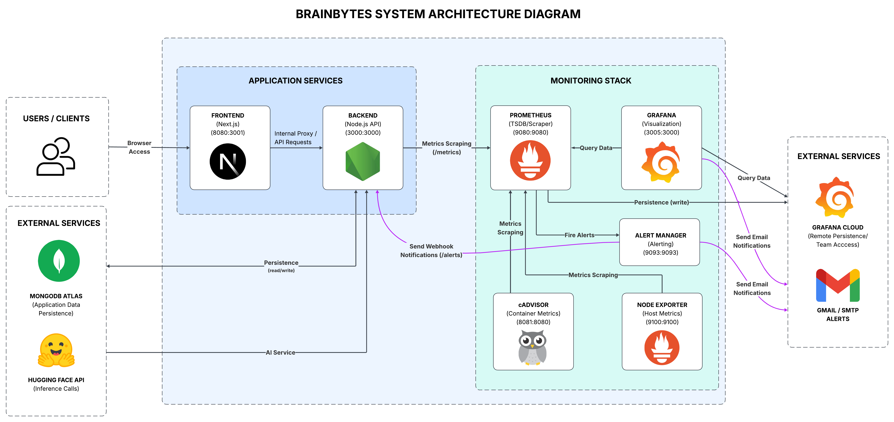

# BrainBytes AI Tutoring Platform

## Project Overview
BrainBytes is an AI-powered tutoring platform designed to provide accessible academic assistance to Filipino students. This project implements the platform using modern **DevOps** practices and containerization.

  

See the architecture below: 

  

  

### Architecture Components

  

| Component | Role | Technology | Port |
|-----------|------|------------|------|
| User Browser | Client interface for application access | Web browser | N/A |
| Frontend Container | Serves the user interface and handles client-side rendering | Next.js | 8080:3001 |
| Backend Container | Processes business logic and manages API requests | Node.js | 3000:3000 |
| MongoDB Atlas | Persists application data | MongoDB (cloud) | N/A |
| Inference Provider | External machine learning service for AI operations | Hugging Face API | N/A |
| Prometheus | Collects and stores metrics data | Prometheus | 9090 |
| Node Exporter | Tracks host system metrics (CPU, memory, disk) | prom/node-exporter | 9100 |
| cAdvisor | Monitors container resource usage | google/cadvisor | 8081 |
| Alertmanager | Handles alert notifications and routing | prom/alertmanager | 9093 |
| Grafana | Visualizes metrics and displays dashboards | Grafana | 3005 |

  

#### Request Flow
1. User interacts with the browser
2. Frontend Container serves the UI and sends API requests to the Backend Container
3. Backend Container processes requests and may call external services (Inference Provider or MongoDB)
4. Responses flow back through the stack to the user's browser

  

#### Key Benefits of This Architecture
- **Separation of Concerns**: Each service runs in isolation, ensuring independence and scalability
- **Lightweight**: Uses managed cloud services to offload infrastructure burden
- **Centralized Data**: Using MongoDB Atlas and Grafana Cloud instead of Docker MongoDB and Grafana data volumes guarantees data persistence across machines, streamlining collaboration within the development team.

  

### AI Tutor Capabilities

  

#### User Modes
| Mode | Description | Data Privacy & Memory |
|------|-------------|-----------------------|
| **Guest Mode** | Fully anonymous access. Ideal for quick, private queries. |  **Zero Retention:** Messages are **not** saved, logged, or stored anywhere. No history is kept. |
| **Authenticated Mode** | Persistent messages. Better AI "memory". |  **Context-Aware:** Chat history is securely saved and fed back to the AI, enabling "memory" for follow-up questions, continuity, and tailored responses. |

  

#### Intelligent Context Handling
The AI adapts its responses based on user input and selected context:

*   **Smart Intent Detection:**
    *   Automatically identifies question types (e.g., *definitions*, *explanations*, *examples*).
    *   Adjusts response depth and format accordingly (e.g., providing a concise definition vs. a detailed breakdown).

*   **Subject-Specific Context:**
    *   Users select a **Subject** via the chat dropdown menu.
    *   The selected subject is passed directly to the AI model, providing essential context to ensure responses are relevant and accurate to the specific domain.

   

## Setup & Installation

### Prerequisites
This project is containerized using **Docker**, ensuring a consistent environment across all operating systems.

Therefore, ensure the following software is installed on your machine:

- **Docker Desktop** (v20.10+ or latest stable)
- **Docker Compose** (usually included with Docker Desktop)
- **Git**
- **Node.js** (v24+)

**Hardware:** Ensure you have at least **4GB of RAM** available for Docker containers to run smoothly.

**OS:** No specific OS version is required. The application runs identically on Windows, macOS, and Linux as long as Docker is properly configured.

 

### Environment Variables

1. Locate the `.env.template` file in the project's **root directory** (alongside `docker-compose.yml`).
2. Copy its contents into a new file named `.env`.
3. Follow the instructions provided in `.env.template` to generate and assign the appropriate values for your environment variables.

 

## Running the Project
 
#### 1. **Clone the repository:**
    git clone https://github.com/Gracielleee/DevOps/tree/main
    cd brainbytes #navigate to the root of the project (same level as docker-compose.yml).

#### 2. **Configure Environment:**
See [COMPLETE-SETUP-GUIDE](docs/COMPLETE-SETUP-GUIDE.md) for detailed environment configuration instructions.

    
#### 3. **Start the Containers:**
   1. Run Docker Desktop
   2. In the terminal, make sure you are on the root directory of the project, then type:

    docker-compose up --build

    #The --build flag ensures the latest code changes are included, but it is optional.

#### 4. **Access the Application:**
  - Frontend: http://localhost:8080
  - Backend API: http://localhost:3000
  - Health Check: http://localhost:3000/health

#### 5. **Stop the Containers:**

    docker-compose down

 

## Common Errors & Troubleshooting

#### 1. Terminal Error: Failed to connect to the docker API

  Common Cause: Docker Desktop is not running.

  Fix:
      Ensure Docker Desktop is up and running.

 

#### 2. Error: connect ECONNREFUSED 127.0.0.1:3000

  Cause: The backend container hasn't started yet, or the health check failed. 

  Fix:
      Ensure your .env file exists and MONGO_URI is correct.

 

#### 3. HuggingFace Inference Error: 401 Unauthorized

Cause: Invalid or missing HF_TOKEN. 

Fix:

  1. Check your .env file. 
  2. Ensure HF_TOKEN is set correctly.
  3. Verify the token has valid permissions on the Hugging Face dashboard.
  4. Restart the backend: `docker-compose restart backend`.

 

#### 4. MongoServerError: Authentication failed

Cause: Incorrect MongoDB URI or credentials. 

Fix:
1. Ensure your IP address is whitelisted in the Atlas network access settings.
2. Ensure the User connecting has the necessary permissions.

 

#### 5. Port Already in Use (bind: address already in use)

Cause: Another application is using port 8080 or 3001. 

Fix:
1. Change the port mapping in docker-compose.yml (e.g., "8081:3000").
2. Or stop the conflicting application.

  

#### 6. CORS Error in Browser Console

Cause: The frontend is trying to access the backend from a different origin without permission. 

Fix:
  1. Ensure FE_URL in the backend environment includes your frontend URL.
  2. In docker-compose.yml, the backend env is set to `http://localhost:8080, http://frontend:3001`. 
  If you change the port, update this list.

 

#### 7. npm install fails inside container

Cause: Node version mismatch or corrupted cache. 

Fix:
1. Delete the node_modules folders in both ./frontend and ./backend directories locally.
2. Run `docker-compose down -v` to remove volumes
3. Rebuild with `docker-compose up --build`

 

## Documentation

For detailed technical information, please refer to the dedicated docs:

| Topic | Description | Link |
|-------|-------------|------|
| **Key Features** | Feature descriptions, user guide, recording of features | [View Key Features](docs/USER-GUIDE.md) |
| **API Reference** | Full endpoint list, auth requirements, and examples | [View API Docs](docs/API.md) |
| **Database Schema** | ERD, field definitions, and indexing strategies | [View DB Schema](docs/DATABASE.md) |
| **Development Workflow** | Branching strategy, PR rules, and team process | [View Contribution Workflow](docs/CONTRIBUTION.md) |
| **CI/CD Workflows** | Workflows, Status badges, and workflow troubleshooting | [View Workflows](docs/CI-CD_WORKFLOWS.md) |
| **Complete Setup Guide** | 	Initial configuration, prerequisites, and installation steps | [View Complete Setup Guide](docs/COMPLETE-SETUP-GUIDE.md) |
| **Monitoring Guide** | Metrics collection, alerting, and dashboards | [View Monitoring Guide](docs/MONITORING-GUIDE.md) |
| **Operations Manual** | Deployment procedures, scaling, backups, and runbooks | [View Operations Manual](docs/OPERATIONS-MANUAL.md) |
| **Troubleshooting Guide** | Common issues, debugging strategies, and error resolution | [View Troubleshooting Guide](docs/TROUBLESHOOTING-GUIDE.md) |

 

---

### Project Goals
- Implement a containerized application with proper networking ✅
- Create an automated CI/CD pipeline using GitHub Actions ✅
- Deploy the application to Render ✅
- Set up monitoring and observability tools ✅

### Team Members
- J.R - Backend Developer - lr.jportillo@mmdc.mcl.edu.ph
- Ralph - Backend Developer - lr.rrnocum@mmdc.mcl.edu.ph
- Krizia - Frontend Developer - lr.kaligado@mmdc.mcl.edu.ph
- Gracielle - Team Lead, DevOps Engineer - lr.gsalvador@mmdc.mcl.edu.ph

---

> **Last Updated**: July 19, 2026 
