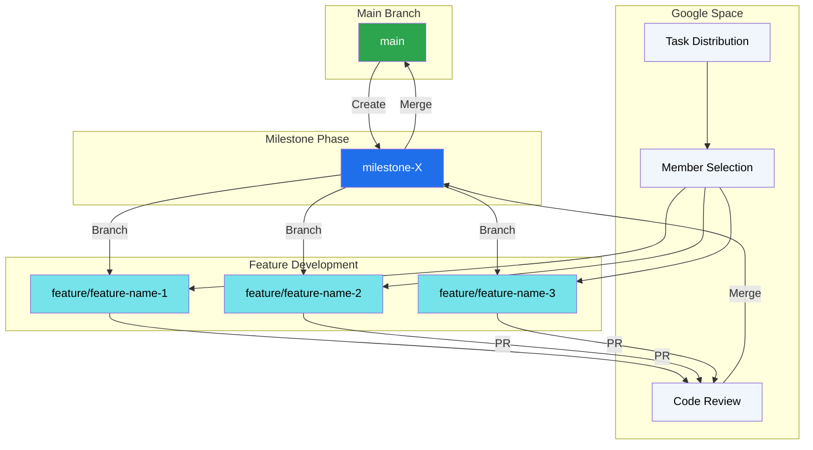

# Development Workflow

## Overview
Our team of 4 uses **Google Space** for communication and task distribution. We follow a **milestone-based branching strategy** where tasks are self-selected, developed in feature branches, reviewed via PRs, and merged into a milestone branch before reaching `main`.

 

Here is a visual representation of our workflow:

### Process
#### 1. Communication & Task Distribution

  - Platform: Google Space
- Process:
        Tasks are posted in the space.
        Team members self-select tasks they wish to work on.

#### 2. Branching Strategy

We use a milestone-based model:
- Main Branch: `main`
- Milestone Branch: `milestone-X` (Created for each sprint/milestone)
- Feature Branches: `feature/<feature-name>` (Created from the milestone branch)

**Flow:**
  1. A new `milestone-X` branch is created from `main`.
  2. Developers branch off `milestone-X` to create `feature/...` branches.
  3. Once features are complete, they are merged back into `milestone-X`.
  4. Finally, `milestone-X` is merged into main.

#### 3. Pull Request (PR) Workflow

1. Develop: Work on your `feature/<name>` branch.
2. Submit PR: Open a Pull Request targeting the `milestone-X` branch.
3. Review: Team members review the code.
4. Merge: After approval and passing checks, merge into `milestone-X`.

#### 4. Code Quality Standards

All code must meet the following criteria before merging:
| Standard	| Requirement |
|---------|----------|
|Conflicts	|Branches must be rebased/merged cleanly.|
|Errors	|Browser console must be clean during testing.|
|Functionality|	All features must work as intended.|
|Peer Review	|At least one team member must approve the PR.|

> Note: If the errors are minor, the peer reviewer may correct and approve the merge. But if errors are significant, the submission will be returned to the team member for revision.
