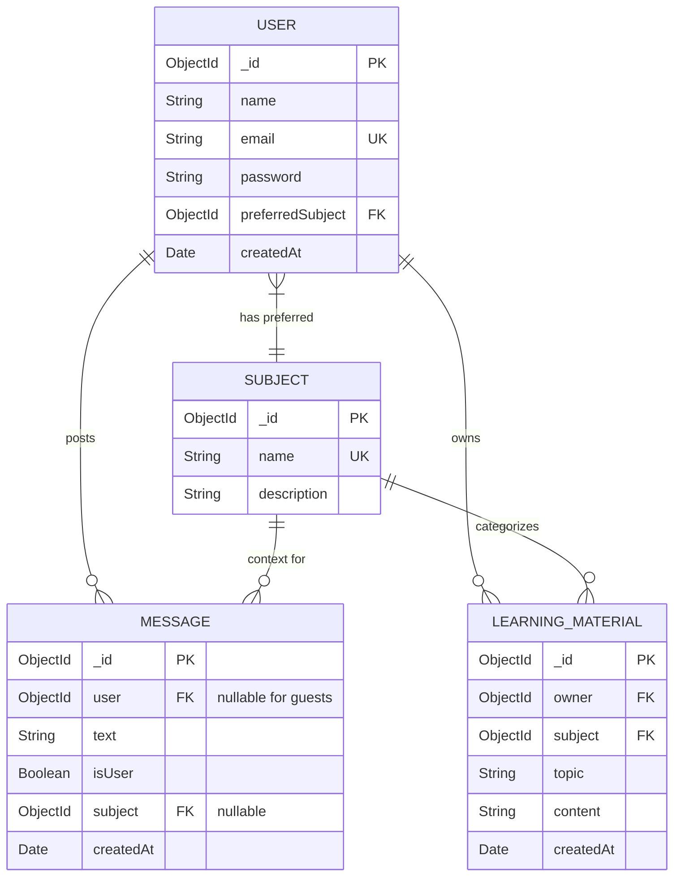

# 🗄️ Database Schema

This project uses **MongoDB** with **Mongoose** ODM. The schema supports user profiles, subject-based learning materials, and a chat system for both authenticated users and anonymous guests.

## 📊 Entity Relationship Diagram (ERD)

## Collection Details
### 1. users (User Profiles)

Stores registered user accounts and their preferences.

|Field	Type |	Required	| Unique	| Description |
|-----------|---------|-------|-------|
|_id |	ObjectId	|Yes	|Yes	|Auto-generated ID|
|name	|String	|Yes	|No	User's display name|
|email	|String	|Yes	Yes	Unique email (lowercase)|
|password	|String |	Yes|	No	|Hidden in API responses (select: false)|
|preferredSubject|	ObjectId	|Yes	|No	|Reference to subjects collection|
|createdAt	|Date	|Yes|	No|	Account creation timestamp|

Indexes:

    email: Unique index for login validation.
    preferredSubject: Index for fast lookup of user preferences.

### 2. subjects
Defines the available learning domains (e.g., Physics, History).
|Field	Type|	Required	|Unique|	Description|
|-----------|---------|-------|-------|
|_id	|ObjectId|	Yes	|Yes	|Auto-generated ID|
|name	|String	|Yes	|Yes	|Unique subject name|
|description	|String	|Yes|	No	|Brief description of the subject|

Indexes:

    name: Unique index to prevent duplicate subjects.

### 3. learning_materials

Stores educational content linked to a user and a subject.
|Field	Type	|Required	|Description|
|-----------|---------|-------|-------|
|_id|	ObjectId	|Yes	|Auto-generated ID|
|owner|	ObjectId	|Yes	|Reference to users (who created it)|
|subject|	ObjectId|	Yes	|Reference to subjects (category)|
|topic	|String	|Yes|	Title or specific topic of the material|
|content|	String	|Yes	|The actual body text/content|
|createdAt|	Date|	Yes	|Creation timestamp|

Indexes:

    owner: For fetching user's materials.
    subject: For filtering materials by topic.
    Compound Index { owner: 1, createdAt: -1 }: Optimizes sorting user materials by newest first.

### 4. messages

Stores chat history. Supports both authenticated users and anonymous guests.
|Field	Type	|Required	|Description|
|-----------|---------|-------|-------|
|_id	|ObjectId	|Yes	|Auto-generated ID|
|user	|ObjectId|	No	Reference to users. Null for guest messages.|
|text	|String	|Yes	|The message content|
|isUser|	Boolean	|Yes	|true if sent by user, false if AI response|
|subject|	ObjectId	|No	|Reference to subjects (context for the chat)|
|createdAt	|Date	|Yes	|Message timestamp|

Indexes:

    user: For retrieving chat history per user.
    subject: For filtering messages by context.
    Compound Index { user: 1, createdAt: -1 }: Optimizes fetching chronological chat history for a specific user (or null for guests).
