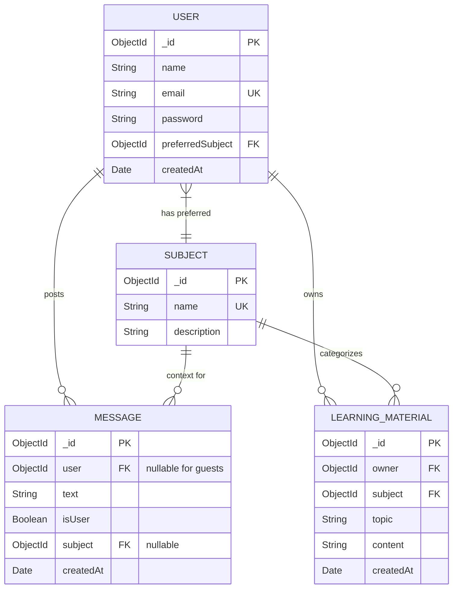

# Database Schema

This project uses **MongoDB**, a **NoSQL** database. The schema supports user profiles, subject-based learning materials, and a chat system for both authenticated users and anonymous guests.

 

## Entity Relationship Diagram (ERD)

 

## Schema Details
### 1. users (User Profiles)

Stores registered user accounts and their preferences.

|Field	| Type |	Required	| Unique	| Description |
|-----| ------|---------|-------|-------|
|_id |	ObjectId	|N/A	|Yes	|Auto-generated ID|
|name	|String	|Yes	|No |	User's display name|
|email	|String	|Yes	|Yes|	Unique email|
|password	|String |	Yes|	No	|User password|
|preferredSubject|	ObjectId	|Yes	|No	|Reference to subjects collection|
|createdAt	|Date	|No|	No|	Account creation timestamp|

### 2. subjects
Defines the available learning domains (e.g., Physics, History).
|Field	|Type|	Required	|Unique|	Description|
|-----|------|---------|-------|-------|
|_id	|ObjectId|	N/A	|Yes	|Auto-generated ID|
|name	|String	|Yes	|Yes	|Unique subject name|
|description	|String	|Yes|	No	|Brief description of the subject|

### 3. learning_materials

Stores educational content linked to a user and a subject.
|Field |	Type	|Required	|Description|
|-----|---------|-------|-------|
|_id|	ObjectId	|N/A	|Auto-generated ID|
|owner|	ObjectId	|Yes	|Reference to users (who created it)|
|subject|	ObjectId|	Yes	|Reference to subjects (category)|
|topic	|String	|Yes|	Title or specific topic of the material|
|content|	String	|Yes	|The actual body text/content|
|createdAt|	Date|	No	|Creation timestamp|

**Compound Index:**

    { owner: 1, createdAt: -1 }: Optimizes fetching learning materials of a specific user.

### 4. messages

Stores chat history. Supports both authenticated users and anonymous guests.
|Field |	Type	|Required	|Description|
|-----------|---------|-------|-------|
|_id	|ObjectId	|N/A	|Auto-generated ID|
|user	|ObjectId|	No	|Reference to users. Null for guest users.|
|text	|String	|Yes	|The message content|
|isUser|	Boolean	|Yes	|true if sent by user, false if AI response|
|subject|	ObjectId	|No	|Reference to subjects (context for the chat)|
|createdAt	|Date	|No	|Message timestamp|
    

**Compound Index:**

    { user: 1, createdAt: -1 }: Optimizes fetching chronological chat history for a specific user.
