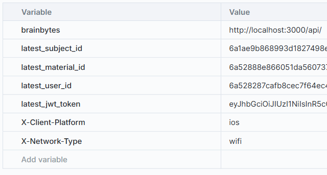

# BrainBytes Monitoring Guide

## Overview

This guide covers the monitoring infrastructure for BrainBytes, which uses **Prometheus** for metrics collection, **Grafana** for visualization, and **Grafana Cloud** for centralized storage.

</br>

---

## Table of Contents

1. [What Are We Monitoring?](#what-are-we-monitoring)
2. [Architecture Overview](#architecture-overview)
3. [Component Breakdown](#component-breakdown)
4. [Setup Instructions](#setup-instructions)
5. [Dashboard Navigation](#dashboard-navigation)
6. [Metrics Reference](#metrics-reference)
7. [Alerting System](#alerting-system)
8. [Testing Your Setup](#testing-your-setup)
9. [File Locations](#file-locations)
10. [Troubleshooting](#troubleshooting)
11. [Security Notes](#security-notes)

</br>

---

## What Are We Monitoring?

| Category               | What It Tracks                                  | Why It Matters                                              |
| ---------------------- | ----------------------------------------------- | ----------------------------------------------------------- |
| **User Experience**    | Active sessions, mobile platform usage, network types, etc. | Ensures users can access the service smoothly               |
| **Application Health** | HTTP requests, response times, error rates, etc.      | Detects when things are slowing down or breaking            |
| **AI Performance**     | AI response latency, empty responses, etc.            | Monitors the core feature's reliability                     |
| **Resources**          | CPU, memory, disk space, network errors, etc.         | Prevents crashes from running out of capacity               |
| **Business Metrics**   | Questions submitted, learning materials created,  etc. | Tracks trends and engagement                        |

</br>

---

## Architecture Overview

### Data Flow
Backend (local or prod) → Prometheus (local) → Grafana Cloud → Grafana (local instance)


### How It Works

1. **Collection** — A local **Prometheus** instance scrapes metrics from the backend (both local and production).
2. **Storage** — Metrics are written to **Grafana Cloud** for centralized, persistent storage.
3. **Visualization** — A local **Grafana** instance retrieves and visualizes data from Grafana Cloud.

> **Security**: The backend `/metrics` endpoint has basic authentication to ensure security in production environments.

### Quick Access Links

| Service       | URL                                     | Notes                          |
| ------------- | --------------------------------------- | ------------------------------ |
| Prometheus    | http://localhost:3000/metrics         | Requires basic auth credentials |
| Grafana       | http://localhost:3005/                | Requires auth credentials                              |
| cAdvisor      | http://localhost:8081/docker/         | Local only                     |
| Node Exporter | http://localhost:9100/metrics         | Local only                     |

> **Note**: cAdvisor and Node Exporter are **not** used in scraping production — they only apply to local development.

</br>

---

## Component Breakdown

| Component        | Port | Purpose                                              |
| ---------------- | ---- | ---------------------------------------------------- | 
| **Prometheus**   | 9090 | Collects and stores raw metrics data                 |
| **Grafana**      | 3005 | Displays dashboards and visualizations               | 
| **Node Exporter**| 9100 | Tracks server hardware health (CPU, disk, memory)    | 
| **cAdvisor**     | 8081 | Monitors Docker container resource usage             |
| **Alertmanager** | 9093 | Handles notifications when issues occur              |

### Prometheus Scrape Targets

| Job Name         | Target                        | Scope        | Auth Required |
| ---------------- | ----------------------------- | ------------ | ------------- |
| `prometheus`     | `localhost:9090`              | Local        | No            |
| `backend`        | `backend:3000`                | Local dev    | Yes (basic auth); endpoint is `/metrics` |
| `render-backend` | `yourservicehere.onrender.com`    | Production   | Yes (basic auth) |
| `node-exporter`  | `node-exporter:9100`          | Local only   | No            |
| `cadvisor`       | `cadvisor:8081`               | Local only   | No            |
| `alertmanager`   | `alertmanager:9093`           | Local        | No            |

> **Note**: `yourservicehere.onrender.com` is a placeholder. `yourservicehere.onrender.com` should be replaced with your actual Render service sub-domain or live production URL.

</br>

---

## Setup Instructions

#### Step 1: Prepare Configuration Files

| Template File                  | Output File           | Purpose                       |
| ------------------------------ | --------------------- | ----------------------------- |
| `prometheus.template.yml`      | `prometheus.yml`      | Defines what to monitor       |
| `alertmanager.template.yml`    | `alertmanager.yml`    | Sets up alert routing         |
| `.env`                         | —                     | Stores sensitive credentials  |

> **Important**: Copy the template files and rename them. Then replace all placeholder variables with actual values from your Grafana Cloud account and email provider.

#### Step 2: Required Environment Variables

Fill these in your `.env` file. Copy values from Grafana Cloud and Email Provider:

| Variable                        | Description                                      |
| ------------------------------- | ------------------------------------------------ |
| `GRAFANA_CLOUD_URL_PUSH`        | Grafana Cloud remote write URL                   |
| `GRAFANA_CLOUD_URL`             | Grafana Cloud query URL (for Grafana datasource) |
| `GRAFANA_CLOUD_USER`            | Grafana Cloud username                           |
| `GRAFANA_CLOUD_WRITE_PASSWORD`  | Password for remote write                        |
| `GRAFANA_CLOUD_PASSWORD`        | Password for querying (Grafana datasource)       |
| `METRICS_AUTH_USERNAME`         | Username for backend `/metrics` auth             |
| `METRICS_AUTH_PASSWORD`         | Password for backend `/metrics` auth             |
| `ALERTS_EMAIL`                  | Email address for sending alert notifications     |
| `ALERTS_PASSWORD`               | SMTP password (app password for Gmail)           |
| `SMTP_EMAIL`                    | Email address to receive alert notifications      |
| `GF_SMTP_USER`                  | Grafana SMTP user (for Grafana-native alerts)    |

#### Step 3: Configure Prometheus

In your copied `prometheus.yml`:

- Replace `GRAFANA_CLOUD_URL_PUSH`, `GRAFANA_CLOUD_USER`, and `GRAFANA_CLOUD_WRITE_PASSWORD` with actual values in the `remote_write` section.
- Replace `METRICS_AUTH_USERNAME` and `METRICS_AUTH_PASSWORD` in the `render-backend` scrape config.
- Replace the `servicehere.onrender.com` target with your actual deployed backend URL.

#### Step 4: Configure Alertmanager

In your copied `alertmanager.yml`:

- Replace `${ALERTS_EMAIL}` and `${ALERTS_PASSWORD}` with your actual Gmail credentials.
- Replace `${SMTP_EMAIL}` with the email address that should receive alerts.
- The template uses `smtp.gmail.com:587` — make sure you're using a Gmail **app password**, not your regular account password.

#### Step 5: Configure Grafana Datasource

Grafana's datasource provisioning (`monitoring/grafana/provisioning/datasources/datasource.yml`) uses environment variables:

| Datasource              | Source            | Default |
| ----------------------- | ----------------- | ------- |
| `GrafanaCloud-Prometheus` | Grafana Cloud   | Yes     |
| `Prometheus`            | Local Prometheus  | No      |

Both datasources will show the same data if remote write is configured correctly.

> Note: For more info on setting up environment variables, check out [`COMPLETE-SETUP-GUIDE`](COMPLETE-SETUP-GUIDE.md)

</br>

---

## Dashboard Navigation

### Quick Access

- Access Grafana at `http://localhost:3005/` (ask your team for credentials)
- View the **BrainBytes** dashboard for system health
- Hover over the ℹ️ icons on charts for explanations
- Use the dropdowns at the top to switch between local/production data

### Dashboard Sections

| Section                     | Panels Include                                            | Best Used By          |
| --------------------------- | --------------------------------------------------------- | --------------------- |
| **Resource Utilization**    | CPU %, memory usage                                       | DevOps, IT            |
| **User Experience**         | Mobile/network type split, active sessions               | Product Managers      |
| **Application Performance** | SLOs, HTTP and AI latencies                               | Engineers, QA         |
| **Error Tracking**          | Error rate, alert status                                  | Engineering Leads     |

> **Note**: Each chart/panel has a description — hover over the ℹ️ icon to understand what it represents.

### Dashboard Controls (Top Dropdowns)

| Control      | Options                                    | What It Does                                                      |
| ------------ | ------------------------------------------ | ----------------------------------------------------------------- |
| **Datasource** | GrafanaCloud-Prometheus (default), Prometheus | Choose where to pull data from (both have same data if remote write works) |
| **Instance** | Local, Render                              | Switch monitoring between local dev and production instances      |

</br>

---

## Metrics Reference

### Metrics Tracking Table

| Metric                                                              | Type                     | Source File(s)                                            |
| ------------------------------------------------------------------- | ------------------------ | --------------------------------------------------------- |
| `httpRequestCounter`, `httpRequestDuration`, `payloadSizeHistogram` | HTTP request tracking    | `requestMonitor.js`                                       |
| `mobilePlatformCounter`                                             | Mobile platform requests | `requestMonitor.js` → `app.js` → `apiFetch.js` (frontend) |
| `aiResponseTimeHistogram`                                           | AI response latency      | `message-controller.js`                                   |
| `questionCounter`                                                   | Question submissions     | `trackers.js` → `message-controller.js`                   |
| `aiEmptyResponseCounter`                                            | Empty AI responses       | `trackers.js` → `ai-service.js`                           |
| `activeSessionsGauge`                                               | Active user sessions     | `auth.js` (via `sessionCache`)                            |
| `learningMaterialsCounter`                                          | Learning material submissions | `trackers.js` → `learning-material.js` (`/routes`)        |
| `connectionDropCounter`                                             | Connection failures      | `errorHandler.js`, `requestMonitor.js`                    |

> **Note**: The SLOs the metrics were based on were taken from the BrainBytes BSRD/SRS documentation.

**Key file locations:**

- Metrics definitions: `backend/monitoring/metrics.js`
- Monitoring root folder: `/monitoring`

</br>

---

## Alerting System

BrainBytes uses **two separate alerting systems**.
#### 1. Prometheus Alertmanager (Primary)

Alertmanager handles alerts **directly from Prometheus** — meaning alert rules are evaluated against raw metrics as they're scraped, with no intermediary layer.

| Alert Group                          | Severity    | Examples                                                        | Scope        |
| ------------------------------------ | ----------- | --------------------------------------------------------------- | ------------ |
| **BrainBytes Critical Alerts**       | Critical    | AI empty responses, high error rate (>5%), AI SLO violation    | All          |
| **BrainBytes Warning Alerts**        | Warning     | HTTP SLO violation, large responses, connection drops           | All          |
| **BrainBytes Resource Alerts**       | Warning     | CPU >85%, memory >85%, high active sessions, network errors    | Primarily local |
| **Infrastructure & Disk Alerts**     | Warning/Critical | Disk space <10%, container restarts, node memory pressure, load average | Local |

This includes **local-only alerts** (resource and infrastructure) that only make sense when running locally with Docker, node-exporter, and cAdvisor.

**Routing:**

- Alerts from `job = "backend"` (local) → sent to a **webhook** on the backend (`/api/alerts`)
- Alerts from `job = "render-backend"` (production) → sent via **email**

#### 2. Grafana Alerts (Secondary)

Grafana handles a smaller set of **informational/trend-based alerts** that are better suited to Grafana's query-and-threshold model:

| Alert Name                 | Condition                                        | Severity | Trigger Window |
| -------------------------- | ------------------------------------------------- | -------- | -------------- |
| `LowQuestionVolume`        | Fewer than 1 question submitted in 12 hours       | Info     | 1h (for condition) |
| `HighLearningMaterialSize` | Large materials (>10KB) being created at >5/sec  | Info     | 2m (for condition) |

These are sent via email through Grafana's built-in SMTP integration.

</br>

---

### Why Prometheus-Native Alerting Is Preferred Over Grafana-Based Alerting

For urgent alerts—error spikes, SLO breaches, infrastructure failures, Prometheus Alertmanager is preferred for its speed, simplicity, and independence from Grafana Cloud. Here were the factors considered:

| Factor               | Prometheus Alertmanager                                       | Grafana Alerts                                              |
| -------------------- | ------------------------------------------------------------ | ----------------------------------------------------------- |
| **Latency**          | Evaluates rules at scrape interval (15s) — near real-time     | Queries through Grafana's API — adds a hop                  |
| **Dependency chain** | Prometheus → Alertmanager → Notification (2 hops)            | Prometheus → Grafana Cloud → Grafana → Notification (3+ hops) |
| **Failure surface**  | If Prometheus is down, you likely already know                | If Grafana Cloud or Grafana is down, alerts silently fail   |

</br>

---

### Alert Rule Reference

#### Critical Alerts

| Alert Name                  | Condition                                        | Duration | 
| --------------------------- | ------------------------------------------------- | -------- | 
| `AIServiceEmptyResponses`   | Empty AI responses >0.1/sec                       | 1 min    |
| `HighErrorRate`             | 5xx errors >5% of total requests per route        | 2 min    |
| `AIResponseSLOViolation`    | P95 AI latency >3s (per subject)                  | 3 min    | 
| `ContainerRestartingFrequently` | Backend container restarts >2 in 5 min        | 2 min    | 

#### Warning Alerts

| Alert Name                  | Condition                                        | Duration | 
| --------------------------- | ------------------------------------------------- | -------- | 
| `HTTPResponseSLOViolation`  | P95 HTTP latency >3s (per route)                  | 5 min    |
| `LargeResponsesRiskBandwidth` | P95 response size >100KB (per endpoint)         | 10 min   | 
| `HighConnectionDropRate`    | Connection drops >1/sec (per reason)             | 2 min    | 
| `BackendCPUUsageHigh`       | Application CPU >85%                             | 5 min    | 
| `ContainerMemoryUsageHigh`  | Container memory >85% (risk of OOM)              | 5 min    | 
| `HighActiveSessions`        | Active sessions >5,000                           | 10 min   |
| `ContainerNetworkErrors`    | Network errors >10/sec                           | 5 min    |
| `DiskSpaceRunningOut`       | Disk space available <10%                        | 5 min    | 
| `HighDockerContainerCPU`    | Docker container CPU >80%                        | 5 min    |
| `NodeMemoryPressure`        | Node memory usage >85%                          | 5 min    |
| `HighLoadAverage`           | Load average >4                                  | 5 min    |

#### Info Alerts (via Grafana)

| Alert Name                  | Condition                                        | Duration | 
| --------------------------- | ------------------------------------------------- | -------- | 
| `LowQuestionVolume`         | Fewer than 1 question in 12 hours                | 1 hr     | 
| `HighLearningMaterialSize`  | Large materials created at >5/sec (by subject)   | 2 min    | 

</br>

---

### Alert Routing Summary
                    ┌─────────────────────┐
                    │   Prometheus        │
                    │   (evaluates rules) │
                    └──────────┬──────────┘
                               │
                ┌──────────────┴──────────────┐
                │                             │
                ▼                             ▼
     ┌──────────────────┐          ┌──────────────────┐
     │  job = "backend" │          │ job = "render-   │
     │  (local dev)     │          │  backend" (prod)  │
     └────────┬─────────┘          └────────┬─────────┘
              │                             │
              ▼                             ▼
     ┌──────────────────┐          ┌──────────────────┐
     │  Backend Webhook │          │  Email (SMTP)    │
     │  /api/alerts     │          │  via Gmail       │
     └──────────────────┘          └──────────────────┘


The backend webhook handler (`backend/src/routes/alerts.js`) receives alerts and logs them:

- **Firing alerts** → logged as `ALERT FIRING` with full details
- **Resolved alerts** → logged as `ALERT RESOLVED`

</br>

---

## Testing Your Setup

### Test 1: Verify Webhook Alerts (Local)

Send a test alert to Alertmanager targeting the local backend:

in **cmd**:
```
curl -X POST http://localhost:9093/api/v2/alerts -H "Content-Type: application/json" -d "[{\"labels\": {\"alertname\": \"HighErrorRate\", \"job\": \"backend\", \"severity\": \"critical\", \"team\": \"backend\", \"route_pattern\": \"/api/v1/test\"}, \"annotations\": {\"summary\": \"Error rate >5%% on /api/v1/test\", \"description\": \"10%% of requests failing (5xx) - TEST ALERT\"}}]"
```


**Expected result**: Wait a few minutes, then check backend logs. You should see `ALERT FIRING: HighErrorRate`.

</br>

---

</br>

### Test 2: Verify Email Alerts (Production Route)

Send a test alert targeting the production route (uses `job = "render-backend"`):

in **cmd**:
```
curl -X POST http://localhost:9093/api/v2/alerts -H "Content-Type: application/json" -d "[{\"labels\": {\"alertname\": \"HighErrorRate\", \"job\": \"render-backend\", \"severity\": \"critical\", \"team\": \"backend\", \"route_pattern\": \"/api/v1/test\"}, \"annotations\": {\"summary\": \"Error rate >5%% on /api/v1/test\", \"description\": \"10%% of requests failing (5xx) - TEST ALERT\"}}]"
```

**Expected result**: Wait a few minutes, then check the email you configured for SMTP. A notification about this alert should arrive.

</br>

---

</br>

### Test 3: Generate Mock Traffic

To populate dashboards with realistic metric data:

1. Import the Postman collection: [`Mock-traffic.postman_collection.json`](collections/Mock-traffic.postman_collection.json)
2. Configure environment variables in Postman (the collection includes scripts that auto-inject most variables)
3. Manually set these headers based on your needs:
   - `X-Client-Platform` — e.g., `ios`, `android`
   - `X-Network-Type` — e.g., `wifi`, `4g`

   Example:
   
   
5. Run the collection (single-run or performance testing)

> **Important**: The `CREATE message` request uses "Hello" as the question text, which triggers a pre-configured response and does **not** call the AI. If you want mock traffic to hit the AI, replace the question text with more specific questions — but be mindful of AI token limits.

</br>

---

## File Locations

| File Path                                                        | Contents                          | Edit When                            |
| ---------------------------------------------------------------- | --------------------------------- | ------------------------------------ |
| `backend/monitoring/metrics.js`                                  | Metric definitions                | Adding new tracked events            |
| `monitoring/prometheus.yml`                                      | Scrape configurations             | Adding/removing scrape targets       |
| `monitoring/alertmanager.yml`                                    | Alert routing rules               | Changing notification destinations   |
| `monitoring/alert_rules.yml`                                     | Alert conditions (Prometheus)     | Modifying alert thresholds           |
| `monitoring/grafana/provisioning/datasources/datasource.yml`     | Grafana datasource connections    | Switching cloud instances            |
| `monitoring/grafana/provisioning/dashboards/brainbytes.json`     | Dashboard configuration           | Redesigning visualizations           |
| `monitoring/grafana/provisioning/alerting/alerts.yml`            | Grafana-native alert rules        | Modifying info-level alerts          |
| `monitoring/grafana/provisioning/alerting/contact-points.yml`    | Grafana alert contact points      | Changing Grafana alert email dest    |
| `monitoring/grafana/provisioning/alerting/policies.yaml`         | Grafana alert routing policies    | Adjusting grouping/repeat intervals  |
| `backend/src/routes/alerts.js`                                   | Alert webhook handler             | Customizing alert logging            |

</br>

---

## Troubleshooting

| Problem                        | Likely Cause                         | Solution                                                      |
| ------------------------------ | ------------------------------------ | ------------------------------------------------------------- |
| Dashboard shows no data        | Prometheus not scraping backend      | Check `prometheus.yml` targets and credentials                |
| No alert emails received       | SMTP credentials incorrect           | Verify `ALERTS_PASSWORD` is a Gmail **app password**, not your regular password |
| Grafana can't connect to Cloud | Wrong URL or credentials             | Re-copy values from Grafana Cloud Settings → Metrics          |
| Backend logs show no alerts    | Webhook endpoint unreachable         | Ensure backend is running at `http://backend:3000`            |
| Metrics look stale (>15 min)   | Network or connectivity issue        | Check firewall rules and Grafana Cloud connectivity           |
| Resource panels empty in prod  | cAdvisor/node-exporter not deployed  | These are local-only — resource panels may not work for prod  |

For more troubleshooting, visit [`TROUBLESHOOTING-GUIDE`](TROUBLESHOOTING-GUIDE.md)

</br>

---

## Security Notes

- **Never commit** `.env` files, `prometheus.yml`, or `alertmanager.yml` with real credentials to version control — use the `.template` files for sharing.
- Use **Gmail app passwords**, not your main account password, for SMTP authentication.
- The backend `/metrics` endpoint requires **basic authentication** in production.
- Grafana Cloud credentials have **separate** read and write passwords — don't reuse them.
- Alert webhook endpoints should not be publicly exposed; they are intended for internal Docker network communication only.

</br>

---

## Additional Resources

| Resource                  | Link                                                    |
| ------------------------- | ------------------------------------------------------- |
| Full Setup Guide          | [`COMPLETE-SETUP-GUIDE`](COMPLETE-SETUP-GUIDE.md)        |
| Detailed Troubleshooting Guide | [`TROUBLESHOOTING-GUIDE`](TROUBLESHOOTING-GUIDE.md) |
| Operations Manual | [`OPERATIONS-MANUAL`](OPERATIONS-MANUAL.md) |
| Grafana Cloud Docs        | [grafana.com/docs/cloud](https://grafana.com/docs/cloud/) |
| Prometheus Docs           | [prometheus.io/docs](https://prometheus.io/docs/)       |
| Alertmanager Docs         | [prometheus.io/docs/alerting](https://prometheus.io/docs/alerting/latest/) |

---

> **Last Updated**: July 19, 2026  
