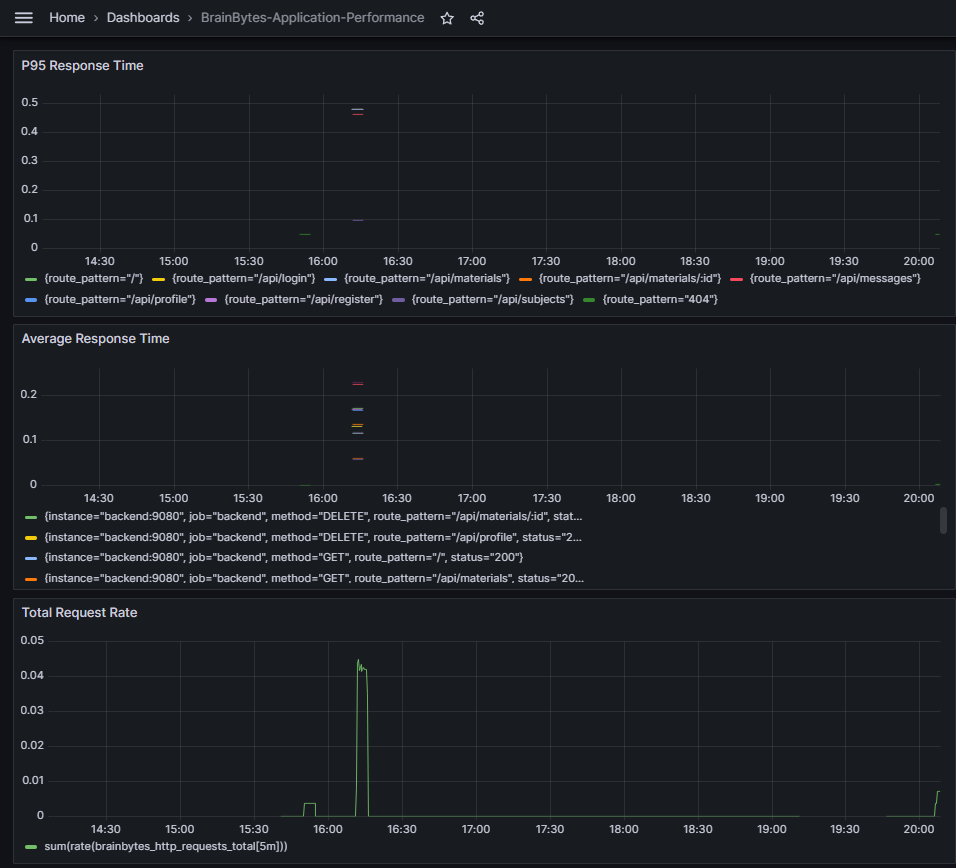
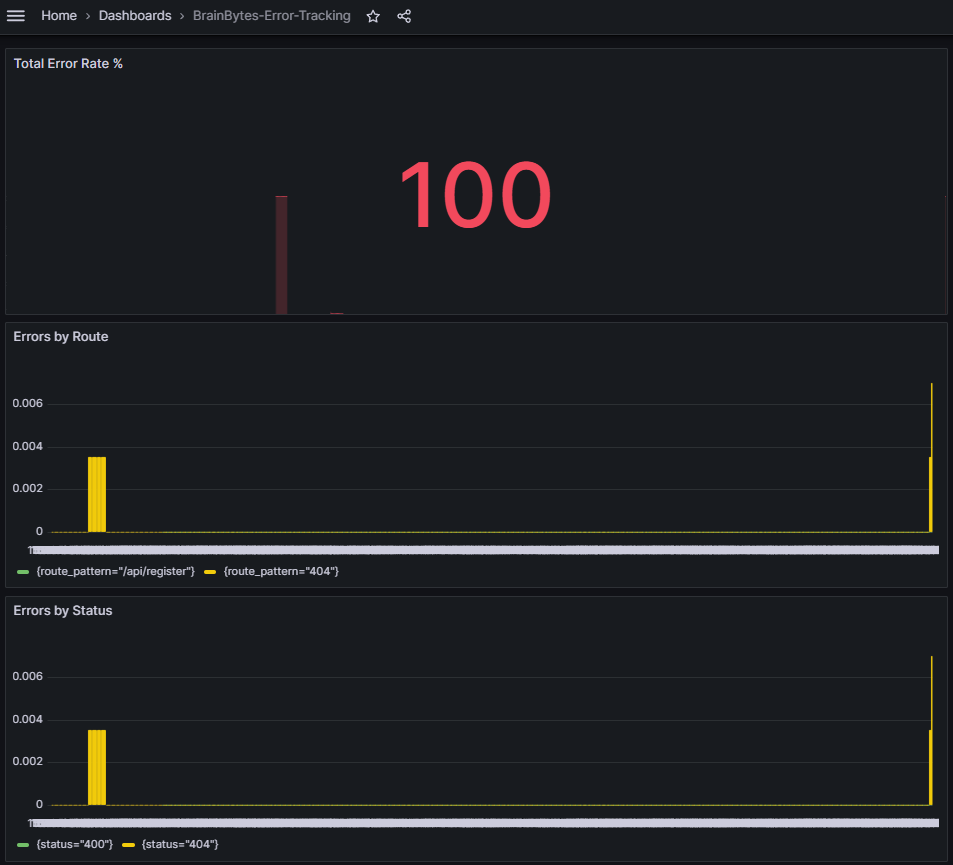

# Monitoring Documentation Package

## 1. Dashboard Catalog

### Application Performance Dashboard

This dashboard is used to monitor request rates and latency (P95). It provides developers and DevOps team members with insights into application behavior under load.

### Error Tracking Dashboard

This dashboard is used to identify and investigate 4xx/5xx errors by route. It helps developers quickly pinpoint problematic API endpoints.

## 2. Metric Dictionary

| Metric Name | Description | Calculation | Normal Range |
| :--- | :--- | :--- | :--- |
| `brainbytes_http_requests_total` | Total HTTP requests | `sum(rate(...))` | Varies with traffic |
| `brainbytes_http_request_duration_seconds` | Request latency | `sum_rate / count_rate` | < 3s (P95) |
| `brainbytes_ai_response_time_seconds` | AI processing time | `sum_rate / count_rate` | < 3s |

## 3. Alert Reference Guide

| Alert Name | Severity | Threshold | Response Procedure |
| :--- | :--- | :--- | :--- |
| `HighErrorRate` | Critical | > 5% failure rate | Check `route_pattern` in logs, verify service health. |
| `AIResponseSLOViolation` | Critical | P95 > 3s | Investigate AI service latency in performance dashboard. |
| `HighCPUUsage` | Warning | > 85% | Check container resource usage (cAdvisor). |

## 4. Monitoring Architecture
*   **Data Flow**: Application (`backend:9080`) -> Prometheus (Scrape) -> Grafana (Visualization/Alerting).
*   **Security**: Metrics port is isolated within the internal `app-network`. Grafana Cloud integration uses secure basic auth.
