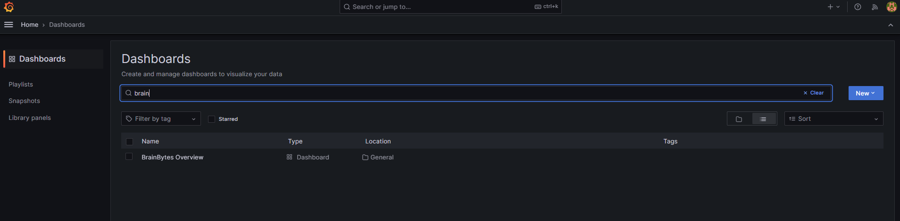
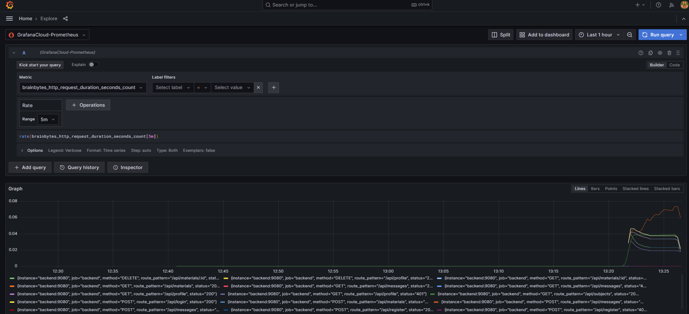
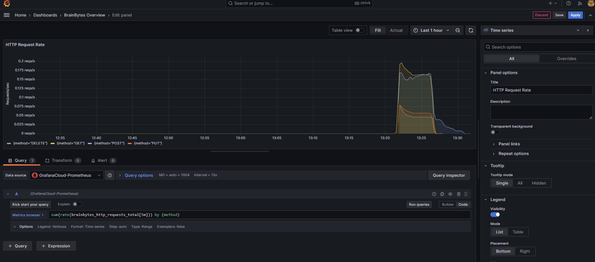

# Monitoring Setup Guide

## Overview
This guide covers the monitoring infrastructure for BrainBytes, which uses **Prometheus** for metrics collection, **Grafana** for visualization, and **Grafana Cloud** for centralized storage.

---------

## Architecture
### Data Flow
```
Backend → Prometheus (local) → Grafana Cloud → Grafana (local instance)
```

**How it works:**
- Backend metrics are scraped by the **local Prometheus instance**
- Data is written to **Grafana Cloud** for centralized storage
- The **local Grafana instance** retrieves and visualizes data from Grafana Cloud
> Currently, prometheus scrapes from the local BrainBytes instance

---------

## Metrics Structure

### File Location
- **Metrics definitions:** `backend/monitoring/metrics.js`
- **Monitoring root folder:** `/monitoring`

### Metrics Tracking Reference
| Metric                                                              | Type                     | Source File(s)                                            |
| ------------------------------------------------------------------- | ------------------------ | --------------------------------------------------------- |
| `httpRequestCounter`, `httpRequestDuration`, `payloadSizeHistogram` | HTTP request tracking    | `requestMonitor.js`                                       |
| `mobilePlatformCounter`                                             | Mobile platform requests | `requestMonitor.js` → `app.js` → `apiFetch.js` (frontend) |
| `aiResponseTimeHistogram`                                           | AI response latency      | `message-controller.js`                                   |
| `questionCounter`                                                   | Question submissions     | `trackers.js` → `message-controller.js`                   |
| `aiEmptyResponseCounter`                                            | Empty AI responses       | `trackers.js` → `ai-service.js`                           |
| `activeSessionsGauge`                                               | Active user sessions     | `auth.js` (via `sessionCache`)                            |
| `learningMaterialsCounter`                                          | Learning material submissions | `trackers.js` → `learning-material.js` (`/routes`)        |
| `connectionDropCounter`                                             | Connection failures      | `errorHandler.js`, `requestMonitor.js`                    |

> Note: The SLOs the metrics were based on were taken from the BrainBytes BSRD/SRS documentation.

---------

## Monitoring Environment Variables Setup
In your `.env` file fill in the the monitoring variables.

```
# The values below are used to store and retrieve monitoring data from a cloud storage. Get these variables from Grafana Cloud: https://grafana.com/orgs/joyfulferry2944/hosted-metrics/3365178

GRAFANA_CLOUD_USER=value_here
GRAFANA_CLOUD_PASSWORD=value_here
GRAFANA_CLOUD_URL=value_here
GRAFANA_CLOUD_URL_PUSH=value_here
```

Go to monitoring/prometheus.example.yml, make a copy of it and name it prometheus.yml.
Copy the env vars and replace the ones on the prometheus.yml

----------

## Grafana Setup
### Accessing Grafana
- URL: http://localhost:3005
- Credentials: `admin` / `admin`
### Pre-configured Resources
- **Dashboard:** provisioned dashboard named `BrainBytes Overview` (auto-provisioned)

- **Data Source:** grafana cloud datasource named `GrafanaCloud_Prometheus` (auto-provisioned)


> Important: Ensure all charts in the dashboard are configured to use `GrafanaCloud_Prometheus` as the data source.


----------

## Mock Traffic Generation
### Using Postman
To test the monitoring system with simulated traffic:
- Import this Postman collection JSON: [Mock Traffic Collection](Mock-traffic.postman_collection.json)
- Configure the environment variables in Postman
- The collection includes scripts that automatically inject other environment variables. 

But you need to manually set the following headers below based on your needs/preference:
   - X-Client-Platform
   - X-Network-Type

- Run the entire collection (single-run or performance testing)
> Important: The `CREATE message` request will not call the AI by default because or pre-configured responses for "Hello". If you want to call the AI during this mock traffic, just replace the question text content with more specific questions. But be careful hitting the AI token limit ceiling

----------

## Next Steps
### Grafana Dashboard Customization (To Do)
- [ ] Review the provisioned `BrainBytes Overview` dashboard at http://localhost:3005
- [ ] Identify required charts based on BSRD/SRS, business context, captured metrics, and CAMU instructions
- [ ] Edit dashboard to add/modify visualizations and layout as needed
- [ ] Ensure all queries reference `GrafanaCloud_Prometheus` as the datasource
- [ ] Update the `monitoring/grafana/dashboard/brainbytes_dashboard.json` with the updated dashboard. Add more dashboard if needed.

### Grafana Alerting (To Do)
- [ ] Configure alert rules in Grafana
- [ ] Set up notification channels (if applicable)
- [ ] Test alerts with mock traffic
- [ ] Refer to CAMU instructions for alerting requirements
